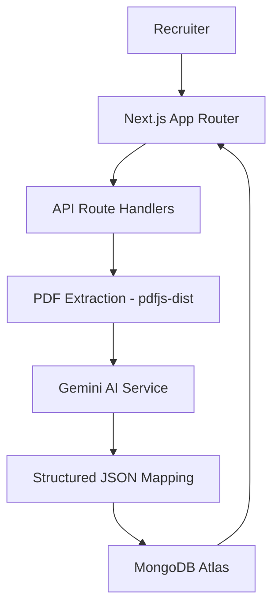

# Cyilima Talents - AI-Powered Recruitment Platform

Cyilima Talents is a state-of-the-art recruitment and talent management platform built for **Umurava**. It leverages advanced AI to automate the screening process, enabling recruiters to identify top talent with unprecedented speed and precision.

## 🚀 Key Features

- **AI-Powered Screening**: Automates the evaluation of candidates against job descriptions using Gemini 3.1 Flash.
- **Smart Resume Parsing**: Extracts structured talent profiles from raw resume text (PDF/DOCX) using LLM-based entities extraction.
- **Bulk Batch Processing**: Parallel processing of hundreds of resumes simultaneously with real-time status tracking.
- **Recycle Bin System**: Comprehensive data lifecycle management with soft-delete and restoration capabilities.
- **Rwanda-Centric Focus**: Tailored features for the local market, including specific location tracking and localized job categories.
- **Premium UI/UX**: A modern, responsive dashboard with a dark-mode first aesthetic and fluid animations.

## 🏗 Architecture Overview



## 🤖 AI Decision Flow

1.  **Text Extraction**: Raw resume data is extracted from PDFs using a custom `pdfjs-dist` pipeline optimized for serverless environments.
2.  **Schema Mapping**: The AI (Gemini 3.1 Flash) processes the raw text to map it into a standardized JSON schema (Skills, Experience, Education, Bio).
3.  **Contextual Screening**: When a job is selected, the AI evaluates the entire candidate pool using a multi-dimensional scoring rubric:
    -   **Technical Alignment (40%)**: Keyword and semantic matching of skills.
    -   **Experience Depth (30%)**: Verification of years and seniority level.
    -   **Market Fit (15%)**: Location and industry relevance.
    -   **Potential (15%)**: Analysis of career progression and headline strength.
4.  **Natural Language Reasoning**: The AI provides a professional justification for every score, explaining *why* a candidate was shortlisted or rejected.

## 🛠 Setup Instructions

### Prerequisites
- Node.js 18+
- MongoDB instance (Atlas or local)
- Google Gemini API Key

### Installation
1.  **Clone the repository**:
    ```bash
    git clone https://github.com/maximemucyo/cyilima-talents.git
    cd cyilima-talents
    ```

2.  **Install dependencies**:
    ```bash
    npm install
    ```

3.  **Configure Environment Variables**:
    Create a `.env.local` file in the root directory:
    ```env
    MONGODB_URI=your_mongodb_uri
    GEMINI_API_KEY=your_gemini_api_key
    NEXTAUTH_SECRET=your_nextauth_secret
    NEXTAUTH_URL=http://localhost:3000
    ```

4.  **Run the development server**:
    ```bash
    npm run dev
    ```

5.  **Seed Initial Data**:
    ```bash
    npx tsx scripts/seed-data.ts
    ```

## 📝 Assumptions & Limitations

- **Resume Quality**: The AI parser works best with standard professional layouts. Scanned images without text layers are not supported in the current version.
- **Connectivity**: Real-time screening requires a stable connection to the Google AI API.
- **Data Scope**: The system is optimized for tech-related roles but can be extended to other industries via prompt engineering.

---
© 2026 Cyilima Team - Umurava Hackathon
